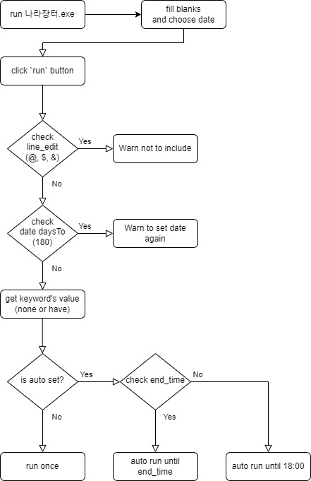

# 나라장터 검색 툴 (updated : 2023-04-14)

## 서론

나라장터에 일일이 들어가서 검색하기 위한 프로세스가 너무 많기에 조금 더 압축하고 스케쥴링을 통한 자동 검색 기능을 넣은 툴

## 본론

### 사용된 기술

1. language : `Python 3.11`
2. idle : `PyCharm`
3. library
    - requests : 나라장터 검색 URL로 get method을 전송하기 위해 사용
    - BeautifulSoup4 : requests 라이브러리 get method 전송 후 받은 html.text를 보기 쉽게 정리와 특정 키워드 서칭
    - PySide6 : CLI 환경에서 GUI 환경으로 변환하고자 사용
    - pyinstaller : *.py를 실행시키기 귀찮아서 *.exe 파일로 만들기 위해 사용

### 플로우차트

사용자 -> 나라장터.exe 실행 -> 검색하고자하는 조건 채워넣기 -> 실행 버튼 클릭 -> 로그창 확인

